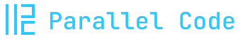
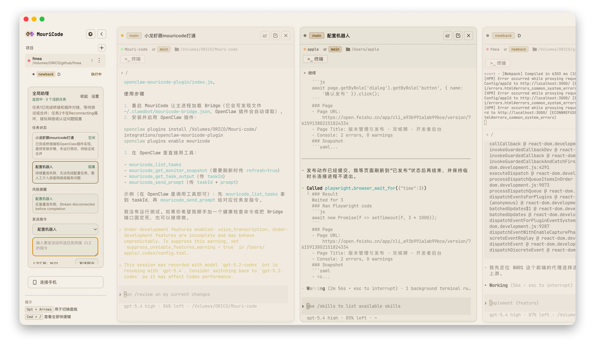
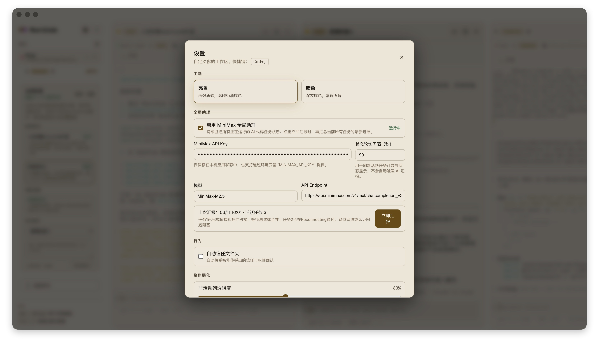

<div align="center">
  
  <h1>MouriCode</h1>
  <p>
    <strong>
      Parallel AI coding tasks. Isolated Git worktrees. Phone monitoring. A global assistant for on-demand status reports.
    </strong>
  </p>
  <p>
    
    
    
    
  </p>
  <p>
    <a href="README.md">English</a> | <a href="README.zh-CN.md">简体中文</a>
  </p>
  <p>
    <a href="#highlights">Highlights</a> ·
    <a href="#screenshots">Screenshots</a> ·
    <a href="#how-it-works">How It Works</a> ·
    <a href="#global-assistant">Global Assistant</a> ·
    <a href="#remote-phone-view">Remote Phone View</a> ·
    <a href="#install--run">Install</a> ·
    <a href="#credits">Credits</a>
  </p>
</div>

---

## Highlights

- Run multiple AI coding agents side by side, each in its own task.
- Every task is isolated: dedicated Git branch + `git worktree`.
- Built-in terminals: AI terminal plus optional shell terminals for human takeover.
- Task-level workflow: diff, commit, push, merge, cleanup.
- Remote phone view for monitoring your agents away from your desk.
- Global Assistant: click once to generate a consolidated status report across active tasks.

---

## Screenshots

<p align="center">
  
</p>

<p align="center">
  
</p>

---

## What MouriCode Can Do

### Parallel tasks, zero conflicts

- Create multiple tasks for the same repo.
- Each task gets its own branch and worktree directory.
- Agents never step on each other.

### Supported agent CLIs

- Claude Code
- Codex CLI
- OpenCode CLI

### Task-level Git workflow

Per task you can:

- View changed files and diff
- Commit changes
- Push to remote
- Merge back to main
- Switch/create branches
- Close task and clean up the worktree

### Direct Mode

If you want to run an agent directly on your main working directory (no worktree), use Direct Mode.

---

## How It Works

When you create a task, MouriCode:

1. Creates a new Git branch from your main branch
2. Sets up a `git worktree` for that branch
3. Starts the selected AI agent inside the worktree
4. Streams live terminal output in the UI (and optionally to the phone view)

This enables true parallel work without branch conflicts.

---

## Global Assistant

MouriCode includes a MiniMax-powered Global Assistant panel.

Current behavior (intentional):

- It does not auto-run tasks or spam commands.
- It monitors active tasks and their terminal output.
- When you click **Immediate Report**, it generates a consolidated status report across all active tasks.
- You can select a task and manually send a typed instruction to that task's running AI CLI.

MiniMax endpoint (default):

- `https://api.minimaxi.com/v1/text/chatcompletion_v2`

---

## Remote Phone View

- Enable remote access in the desktop app.
- Scan the QR code on your phone.
- Monitor task terminals over Wi-Fi or Tailscale.

---

## Install & Run

### Requirements

- Node.js 18+
- npm
- At least one AI agent CLI installed (Claude Code / Codex CLI / OpenCode CLI)

### Dev

```bash
git clone <your-repo-url>
cd mouri-code
npm install
npm run dev
```

### Build

```bash
npm run build
```

---

## Repository

- GitHub: [https://github.com/mouritang/mouri-code](https://github.com/mouritang/mouri-code)
- Gitee: [https://gitee.com/mouritang/mouri-code](https://gitee.com/mouritang/mouri-code)

### Clone

```bash
# GitHub
git clone https://github.com/mouritang/mouri-code.git

# Gitee (国内镜像)
git clone https://gitee.com/mouritang/mouri-code.git
```

---

## Credits

MouriCode is a modified fork based on **Parallel Code**.

Thanks to the original author and contributors for building the foundation this project extends.

- Upstream project: Parallel Code (Johannesjo)
